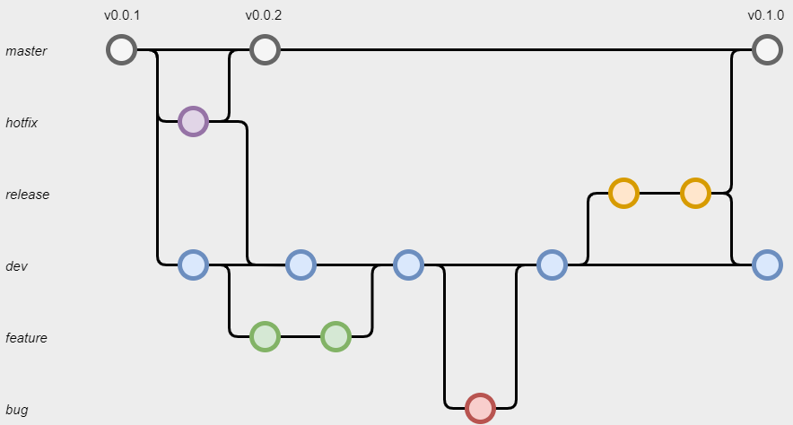

# Règles concernant le versioning

## Gitflow
Tous les projets ESE'OS devront suivre le gitflow défini ci-dessous. 

## Branches

 - `master` est la branche principale de tous les projets. Elle devra être stable en toutes circonstances, et seules les branches release pourront être *push* dessus. Elle est équivalente à la branche de production.

 - `hotfix` est un type de branche permettant de corriger rapidement les bugs découvert en production (sur la branche `master`). Sachant que cette dernière est censéee être testée et éprouvée, son utilisation doit rester le plus exceptionnel possible.

 - `release` est un type de branche permettant d'effectuer une batterie de tests fonctionnels avant de *push* sur la branche `master`. Elle est équivalente aux branches de recette.

 - `dev` est la branche principale de développement. Elle constitue la branche de départ et d'arrivée des branches `feature` et `bug`.

 - `feature` est un type de branche où sont développées les nouvelles fonctionnalités. Elles porteront le nom des *issues* qu'elles cherchent à résoudre.
   -> *Ex: feature/124-create-giroud-command*

 - `bug` est un type de branche où sont corrigés les bugs relevés. Similaire aux `features` pour les nommer, la différence porte sur la nature de l'*issue* traitée.
   -> *Ex: bug/78-login-bug*

## Revues de code (voir [REVIEWING](REVIEWING.md))

Avant qu'un bug ou une feature soit mergée sur la banche `dev`, il faut **impérativement** qu'elle soit revue par au moins une deuxième personne. Son rôle est de vérifier que le code est lisible, bien documenté, et qu'il fonctionne conformément à ce qui était souhaité dans l'*issue*. Pour simplifier son travail, il est fortement recommandé au développeur de lui fournir des scénarios de tests (/!\ ce ne sont pas toujours des tests exhaustifs, il est important d'avoir un avis critique dessus).